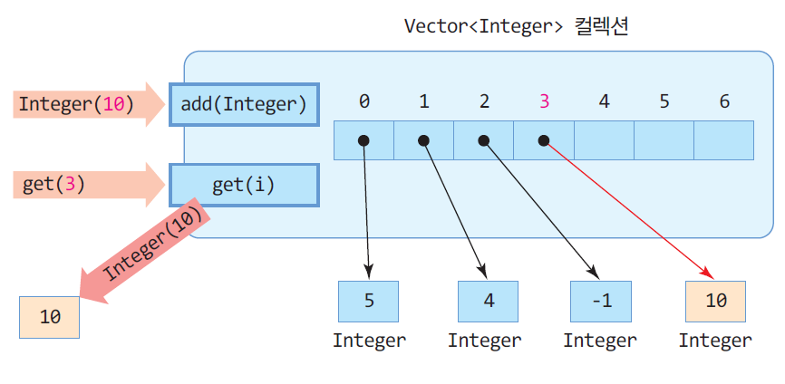
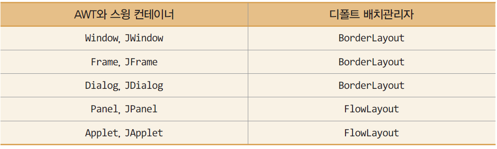
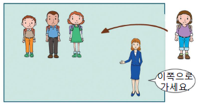
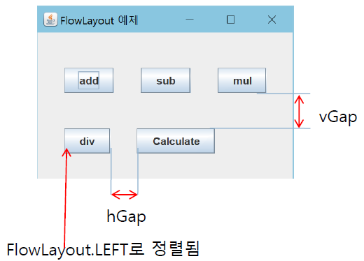
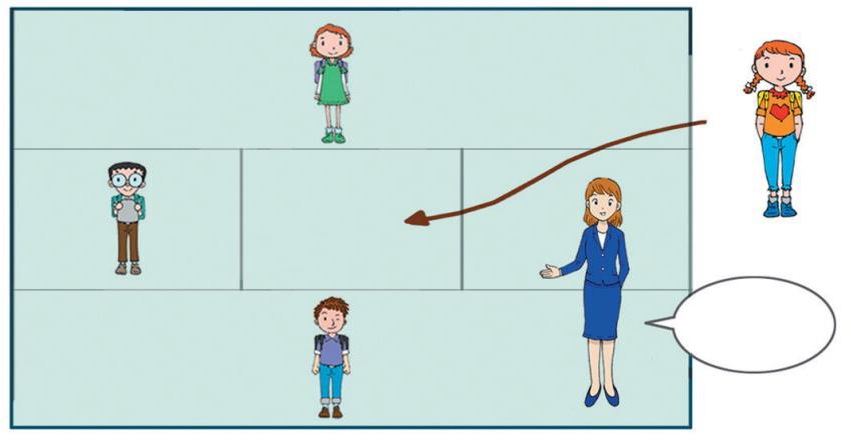
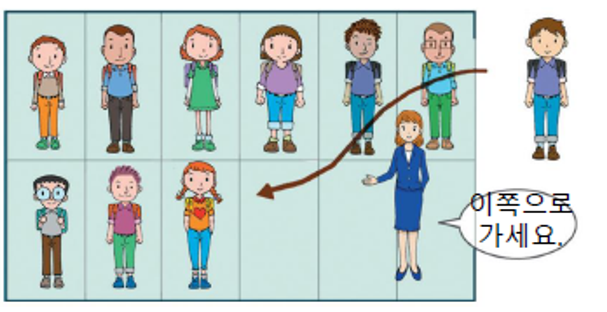
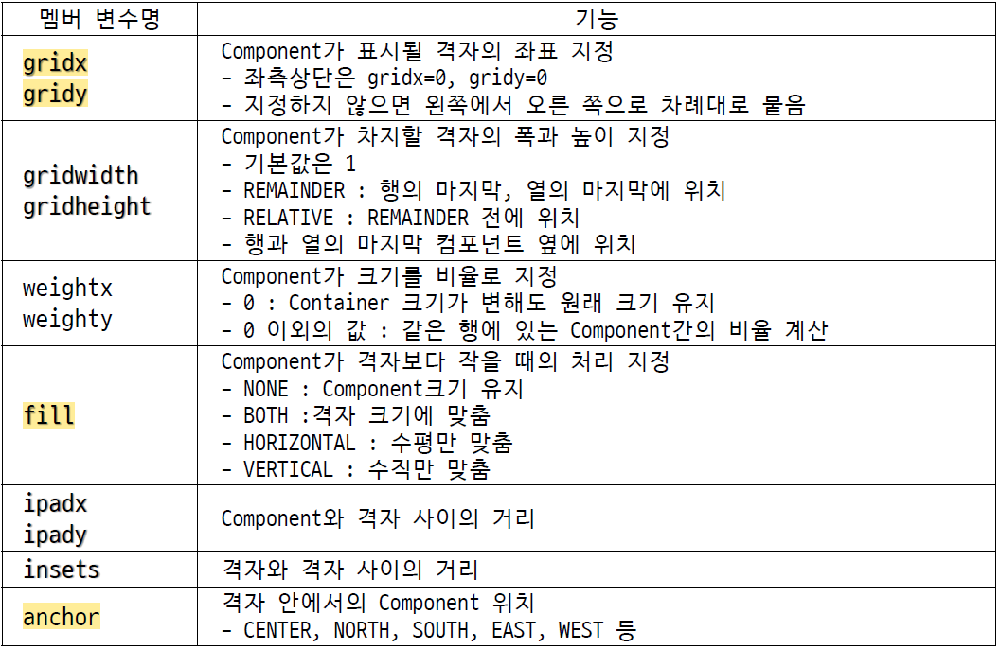

# 10주차

소유자: Andy Lee
최종 편집 일시: 2024년 5월 15일 오후 5:55

# Vector<E>

배열을 가변 크기로 다룰 수 있게 하는 컨테이너

- 배열의 길이 제한 극복
- 요소의 개수가 넘치면 자동으로 길이 조절
- 삽입, 삭제에 따라 자동으로 요소의 위치 조정



## Vector<Integer> 예시의 자주 사용되는 명령어

`Vector<Integer> v = new Vector<>(7);`

| v.add(5); | 백터의 맨 뒤에 정수 5 추가. |
| --- | --- |
| v.add(0, 100) | 0번째 인덱스에 요소 100 중간 삽입.
단, v.size() 보다 큰 곳에 삽입 불가능. |
| int n = v.size(); | 백터가 포함하는 요소의 개수 리턴.
n = 2 |
| int c = v.capacity(); | 백터의 현재 용량 리턴.
c = 7 |
| int i = v.get(1) | 1번째 인덱스의 요소 리턴. (자동 언박싱)
i = 100 |
| v.remove(1); | 1번째 인덱스의 요소 삭제 |
| int last = v.lastElement(); | 마지막 요소 100 리턴. |
| v.removeAllElements(); | 모든 요소 삭제. |

# ArrayList (강의하지 않음)

벡터와 달리 동기화 기능을 제공하지 않음

<aside>
❗ 동기화: 스레드가 동시에 접근될 때 접근되는 순서를 결정

</aside>

# Iterator<E> 인터페이스

리스트 구조의 컬렉션에서 요소의 **순차 검색**을 위한 인터페이스. (제네릭으로 생성)

- Vector<E> ArrayList<E> LinkedList<E>가 상속받는 인터페이스

> new 키워드로 객체를 생성할 수 없지만, `.iterator()` 메서드로 레퍼런스를 얻을 수 있다.
> 

`.next()` 메서드로 다음 요소를 리턴받을 수 있다. (auto-unboxing 발생)

# HashMap<K, V>

키(key)와 값(value)의 쌍으로 구성되는 요소를 다루는 컬렉션

K: 키로 사용할 요소의 타입
V: 값으로 사용할 요소의 타입

값을 검색하기 위해 반드시 key 사용

요소 삽입 = `put()` 메소드
요소 검색 = `get()` 메소드

순서가 없다.

## HashMap 예제

```java
HashMap<String, String> h = new HashMap<>();

h.put("apple", "사과");
String kor = h.get("apple");  // kor = "사과"
```

# 제네릭 클래스 만들기

(제네릭 메서드는 설명하지 않음)

클래스 이름 옆에 일반화된 타입 매개 변수 추가

## ❗자료구조 (Stack)

Stack, Que 등이 있음 그중 Stack만 설명

**LIFO (Last In First Out)**

```java
// push
s[sp] = n;
sp++;

// pop
sp--;
return s[sp];
```

<aside>
❗ Generic Stack 예제 복습하며 만들어봤음. 코드 참조.

</aside>

## Generic Type의 배열 생성

Java에서는 T 타입의 배열을 사용할 수 없다.

T 타입의 배열 생성은 근본적으로 불가능하지만
필요시 Object 타입의 배열 생성은 가능

```java
T[] arr = new T[size];  // 불가능
T[] arr = (T[])(new Object[size])  // 가능
```

## Generic Type Parameter

```java
// Bounded type : 가능한 type 의 제한
<T extends TYPE> // 지정된 TYPE 또는 그 하위 TYPE만 가능

// 예시
public static <T extends String> int test()
public static <T extends Number> int test() // 숫자 타입
```

```java
// Wildcard type : 구체적 type지정 없음
<?> // 제한 없음 (모든 타입)
<? extends TYPE> // 지정된 TYPE 또는 그 하위 TYPE만 가능
<? super TYPE> // 지정된 TYPE 또는 그 상위 TYPE만 가능
```

# Java GUI (AWT, Swing)

## AWT

`heavy-weight` 컴포넌트.
운영체제가 렌더링 (실행 속도가 빠른편)

클래스 앞에 `J` 가 붙지 않음

## Swing

`light-weight` 컴포넌트.
직접 렌더링 (운영체제에 부담 X)

모든 클래스 앞에 `J` 가 붙음
(JButton,  JCheckBox, JRadioButton, JSlider, JTextField, …)

## 컨테이너

다른 컴포넌트를 포함할 수 있는 GUI 컴포넌트

`java.awt.Container` 를 상속받음

⭐⭐⭐ Swing 컨테이너: `JPannel`, `JFrame`, `JApplet`, `JDialog`, `JWindow`

### Content Pane

화면에 출력될 모든 GUI 컴포넌트들이 부착되는 공간

```java
// Content Pane 알아내기
Container contentPane = this.getContentPane();

// Content Pane에 컴포넌트 붙이기
JButton button = new JButton("Click");
contentPane.add(button);
```

## 컴포넌트

컨테이너에 포함되어야 화면에 출력될 수 있는 GUI 객체

다른 컴포넌트를 포함할 수 없는 순수 컴포넌트

Swing 컴포넌트가 상속받는 클래스: `javax.swing.JComponent` 

## ⭐⭐ 최상위 컨테이너

**`JFrame`**, **`JDialog`**, **`JApplet`**

다른 컨테이너에 포함되지 않고도 화면에 출력되며, 독립적으로 존재 가능한 컨테이너

## 기본 프레임 생성하기

```java
// Step 1
import java.awt.*;  // *은 모든 클래스만 불러옴 (패키지는 X)
import java.awt.event.*;
import javax.swing.*;
import javax.swing.event.*;

// Step 2
public class MyFrame extends JFrame {

  // Step 4
  public MyFrame() {
    this.setTitle("My First Frame");
    this.setDefaultCloseOperation(JFrame.EXIT_ON_CLOSE);  // X 버튼 누르면 프로그램 종료
    this.setSize(400, 300);
    this.setVisible(true);  // 화면에 나타남
  }

  public static void main(String[] args) {
    // Step 3
    new MyFrame();  // 생성자 실행
  }

}
```

스윙 응용프로그램에서 main() 의 기능 최소화 바람직
스윙 응용프로그램이 실행되는 시작점으로서의 기능만
스윙 프레임을 생성하는 정도의 코드로 최소화

## 배치 관리자

FlowLayout, BorderLayout, GridLayout, ~~CardLayout~~ (사용하지 않음)

### 컨테이너의 디폴트 배치관리자



<aside>
❗ 기본으로 생성되는 특수한 JPanel 은 `BorderLayout` 이다.

</aside>

### FlowLayout

컴포넌트가 삽입되는 순서대로 왼쪽에서 오른쪽으로 배치
배치할 공간이 없으면 아래로 내려와서 반복한다.



```java
FlowLayout()
FlowLayout(int align, int hGap, int vGap)
/*
align: 컴포넌트를 정렬하는 방법 지정.
hGap: 좌우 두 컴포넌트 사이의 수평 간격. 픽셀 단위. default = 5
vGap: 상하 두 컴포넌트 사이의 수직 간격. 픽셀 단위. default = 5
*/
```

기본 여백(Gap)이 5px 이다.



### BorderLayout

컨테이너 공간을 5구역으로 분할, 배치 (동서남북, 중앙)



```java
// 생성자
BorderLayout()
BorderLayout(int hGap, int vGap)
/*
hGap: 좌우 두 컴포넌트 사이의 수평 간격. 픽셀 단위. default = 0
vGap: 상하 두 컴포넌트 사이의 수직 간격. 픽셀 단위. default = 0
*/

// 배치 방법. comp를 index의 공간에 배치
add(Component comp, int index)

// 예제
container.setLayout(new BorderLayout());
container.add(new JButton("div"), BorderLayout.WEST);
```

### GridLayout

컨테이너 공간을 동일한 사각형 격자로 분할하고 각 셀에 컴포넌트 배치



```java
// 생성자
GridLayout()
GridLayout(int rows, int cols)
GridLayout(int rows, int cols, int hGap, int vGap)
/*
hGap: 좌우 두 컴포넌트 사이의 수평 간격. 픽셀 단위. default = 0
vGap: 상하 두 컴포넌트 사이의 수직 간격. 픽셀 단위. default = 0
*/

// 예제
container.setLayout(new GridLayout(4, 3));
container.add(new JButton("1"));
container.add(new JButton("2"));
```

### GridBagLayout

GridLayout과 유사하나, 각 영역을 서로 다른 크기로 지정할 수 있으며, 인접한 열 또는 행으로 확장 가능



GridBagConstraints 클래스의 멤버 변수

### 배치 관리자가 없는 컨테이너

응용프로그램에서 직접 컴포넌트의 크기와 위치를 결정

```java
// 컨테이너의 배치 관리자 제거
container.setLayout(null);
```

컨테이너의 배치 관리자가 없으므로 컴포넌트들이 배치되지 않기에
컴포넌트의 절대 크기와 위치를 설정해줘야 한다.

```java
setSize(int width, int height)
setLocation(int x, int y)
setBounds(int x, int y, int width, int height)  // 컴포넌트의 위치와 크기 동시 설정
```