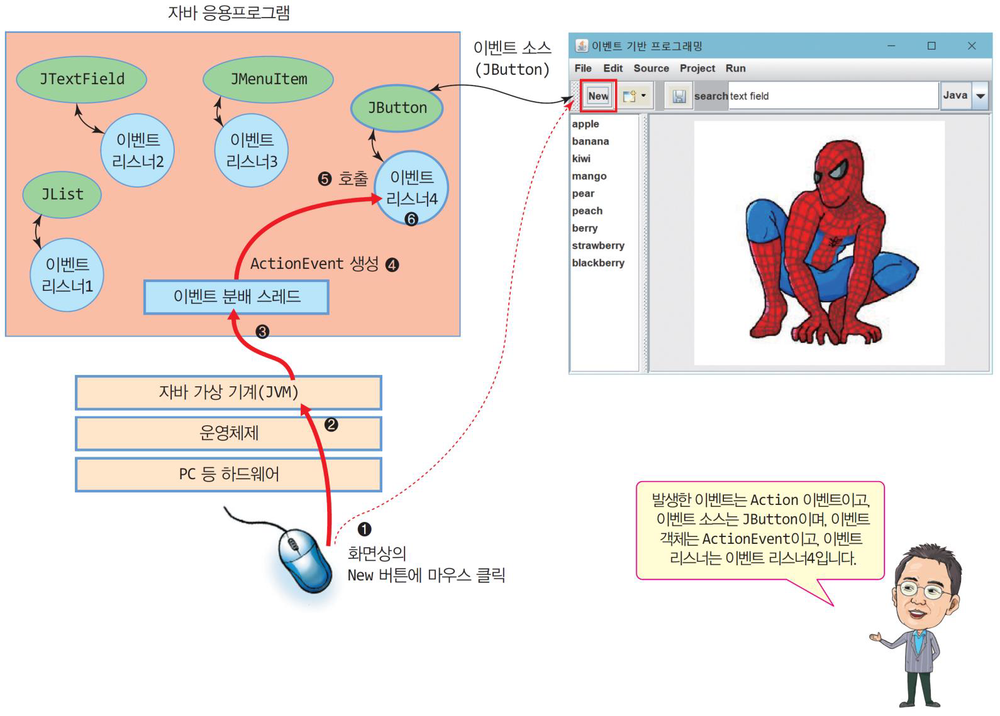
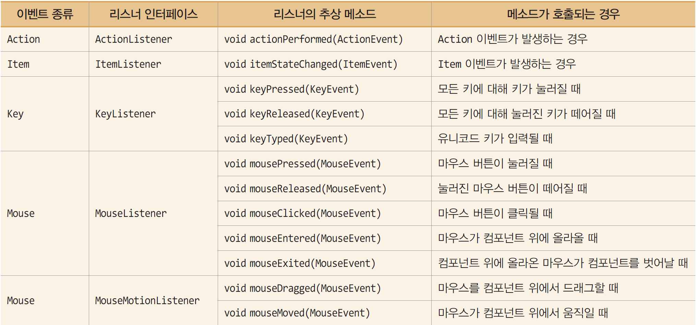
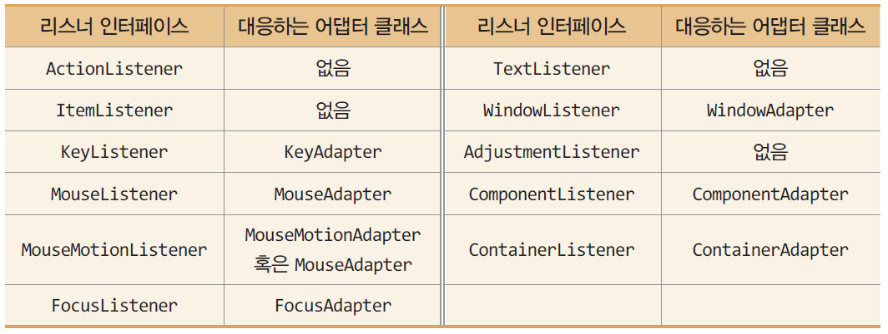
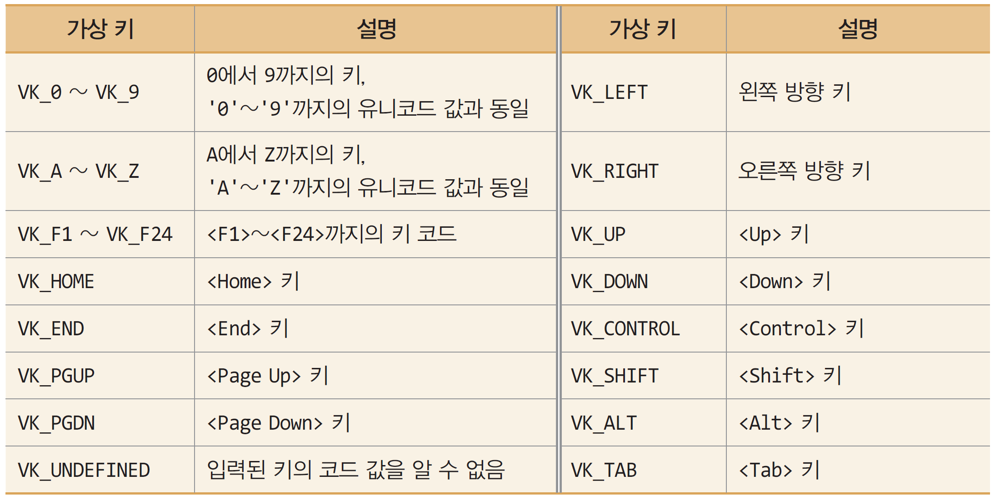
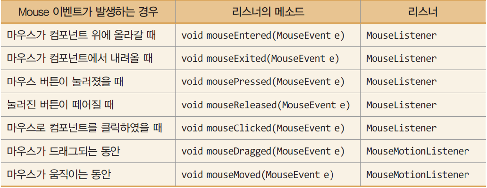

# 11주차

소유자: Andy Lee
최종 편집 일시: 2024년 5월 25일 오후 4:20

# 이벤트 기반 프로그래밍

이벤트 발생에 의해 프로그램 흐름이 결정되는 방식
(반대 개념은 batch 프로그래밍)

이벤트 종류: 사용자의 입력, 센서로부터의 입력, 다른 응용프로그램이나 스레드로부터의 메세지

## 이벤트 처리 과정

이벤트 발생 →
이벤트 객체 생성 →
응용프로그램에 작성된 이벤트 리스너 찾기 →
이벤트 리스너 실행



## 이벤트 객체

발생한 이벤트에 관한 정보를 가진 객체
이벤트 리스너에 전달됨.

### 이벤트 객체가 포함하는 정보

- 이벤트 종류와 이벤트 소스
- 이벤트가 발생한 화면 좌표 및 컴포넌트 내 좌표
- 이벤트가 발생한 버튼이나 메뉴 아이템의 문자열
- 클릭된 마우스 버튼 번호 및 마우스의 클릭 횟수
- 키의 코드 값과 문자 값
- (체크 박스, radio 버튼 등과 같은 컴포넌트) 이벤트가 발생했다면 체크 상태

### EventObject

`Object getSource()` 

이벤트 소스를 알아내는 메소드
Object 타입으로 리턴하므로 캐스팅하여 사용
모든 이벤트 객체에 대해 적용

### ❗ActionEvent

- JButton - 마우스나 <Enter> 키로 버튼 선택
- JMenuItem - 메뉴 아이템 선택
- JTextField - 텍스트 입력 중 <Enter> 키 입력

`String getActionCommand()` 

### ❗ItemEvent

- JCheckBox - Checkbox의 선택 또는 해제
- JRadioButton - Radio 버튼의 선택 상태가 변할 때
- JCheckBoxMenuItem - Checkbox 메뉴 아이템의 선택 혹은 해제

`Object getItem()`

`int getStateChange()`

### ❗KeyEvent

- Component - 키가 눌러지거나 눌러진 키가 떼어질 때

`char getKeyChar()`

`int getKeyCode()`

`String getKeyText()`

### ❗MouseEvent

- Component를 상속받은 모든 GUI 컴포넌트

`int getButton()`

`int getClickCount()`

`Point getPoint()`

`int getX()`

`int getY()`

# 이벤트 리스너

이벤트를 처리하는 Java 프로그램 코드. 클래스로 작성

Java는 다양한 리스너 인터페이스 제공
(ActionListener Interface, MouseListener Interface, …)



## 사용자의 이벤트 리스너 작성

기본적으로 Java의 리스너 interface를 상속받아 구현
리스너 interface의 모든 추상 메소드 구현

- 독립 클래스로 작성
    - 이벤트 리스너를 완전한 클래스로 작성
    - 이벤트 리스너를 여러 곳에서 사용할 때 적합
    
    ```java
    class MyActionListener implements ActionListener {
        @Override
        public void actionPerformed(ActionEvent e) {
          ...
        }
      }
    ```
    
- 내부 클래스로 작성
    - 클래스 안에 멤버처럼 클래스 작성
    - 이벤트 리스너를 특정 클래스에서만 사용할 때 적합
    
    ```java
    public class InnerClassListenerEx extends JFrame {
    	...
    	
    	private class MyActionListener implements ActionListener {
        @Override
        public void actionPerformed(ActionEvent e) {
    	    ...
        }
      }
    }
    ```
    
- 익명 클래스로 이벤트 리스너 작성
    - 클래스의 이름 없이 간단히 리스너 작성
    - 클래스 조차 만들 필요 없이 리스너 코드가 간단한 경우에 적합
    
    ```java
    // 클래스를 정의함과 동시에 객체 생성
    b.addActionListener(new ActionListener() {
    	@Override
    	public void actionPerformed(ActionEvent e) {
    		...
    	}
    });
    ```
    

## 이벤트 리스너 등록

이벤트를 받아 처리하고자 하는 컴포넌트에 이벤트 리스너 등록

`component.addXXXListener(listener);`

XXX: 이벤트 명, listener: 이벤트 리스너 객체

```java
MyActionListener listener = new MyActionListener();
btn.addActionListener(listener);
```

## MouseListener 예제 중..

Frame의 생성자에 JLabel 객체를 만들고, 이벤트 리스너를 익명 클래스로 선언해도 컴파일러에서 자동으로 JLabel 객체의 레퍼런스를 힙 영역에 final로 로드해서 참조할 수 있게 만들어준다.

<aside>
❗ 항상 이벤트 리스너 클래스를 선언할 때 필드들이 접근 가능한지 확인하는 것이 중요하다.

</aside>

## 어댑터 클래스

이벤트 리스너의 추상 메소드를 모두 구현해야 하는 부담이 있기 때문에
리스너의 모든 메소드를 단순 리턴하도록 만든 클래스 (JDK에서 제공)

```java
class MouseAdapter implements MouseListner, MouseMotionListener, MouseWheelListener {
	public void mousePressed(MouseEvent e) {}
	public void mouseReleased(MouseEvent e) {}
	public void mouseClicked(MouseEvent e) {}
	public void mouseEntered(MouseEvent e) {}
	public void mouseExited(MouseEvent e) {}
	public void mouseDragged (MouseEvent e) {}
	public void mouseMoved (MouseEvent e) {}
	public void mouseWheelMoved (MouseWheelEvent e) {}
}
```

- 추상 메소드가 하나뿐인 리스너는 어댑터가 없음
    - ActionAdapter, ItemAdapter



## KeyListener

### 메소드가 호출되는 순서

`keyPressed()`  키를 누르는 순간

`keyTyped()` *(유니코드 키인 경우에만)*

`keyReleased()`  누른 키를 떼는 순간

### 포커스

키 이벤트를 받을 수 있는 조건은 현재 포커스를 가진 컴포넌트가 키 이벤트 독점

컴포넌트에 포커스 설정 방법 : 다음 2 라인 코드 필요

```java
component.setFocusable(true); // component가 포커스를 받을 수 있도록 설정
component.requestFocus(); // component에 포커스 강제 지정
```

### 키 이벤트 리스너 달기

```java
component.addKeyListener(myKeyListener);
```

### 가상 키와 입력된 키 판별 (정리하기)

- KeyEvent 객체
    - 입력된 키 정보를 가진 이벤트 객체
    - KeyEvent 객체의 메소드로 입력된 키 판별
- KeyEvent 객체의 메소드로 입력된 키 판별
    1. `char KeyEvent.getKeyChar()`
        - 키의 **유니코드 값** 리턴
        - Unicode 문자 키인 경우에만 의미 있음
        - 입력된 키를 판별하기 위해 문자 값과 비교하면 됨
    2. `int KeyEvent.getKeyCode()`
        - **모든 키에 대한 정수형 키 코드** 리턴
        - 운영체제나 하드웨어에 따라 서로 다를 수 있기 때문에, 입력된 키를 판별하기 위해 **반드시 `getKeyCode()`가 리턴한 키 코드와 가상키(Virtual Key) 값을 비교하여야 함**
        - 가상 키는 KeyEvent 클래스에 `VK_`로 시작하는 static 상수로 선언되어 있다.
        
        
        

## Mouse 이벤트와 MouseListener, MouseMotionListener

- Mouse 이벤트
    
    사용자의 마우스 조작에 따라 발생하는 이벤트
    
    
    
- 마우스가 눌러진 위치에서 떼어지는 경우 메소드 호출 순서
    
    `mousePressed()` → `mouseReleased()` → `mouseClicked()` 
    
- 마우스가 드래그될 때 메소드 호출 순서
    
    `mousePressed()` → `mouseDragged()` → `mouseDragged()` → `…` → `mouseReleased()` 
    

<aside>
❗ `mouseClicked()`와 `mouseReleased()`의 차이
mouseClicked()는 한 컴포넌트에 마우스 버튼이 눌러졌다가 떼어질 때에만 호출된다.
mouseReleased()는 마우스 버튼이 눌러진 컴포넌트를 벗어나 다른 컴포넌트 위에서 떼어질 때에도 눌러진 컴포넌트에서 호출된다.

</aside>

### 마우스 리스너 달기

```java
component.addMouseListener(myMouseListener);
```

- 컴포넌트가 `mouseMoved()`나 `mouseDragged()`를 함께 처리하고자 하는 경우 MouseMotion 리스너 따로 등록

```java
component.addMouseMotionListener(myMouseMotionListener);
```

### MouseEvent 객체 활용

- 마우스 포인터의 위치, 컴포넌트 내 상대 위치
    
    `int getX()`, `int getY()`
    
- 마우스 클릭 횟수
    
    `int getClickCount()`