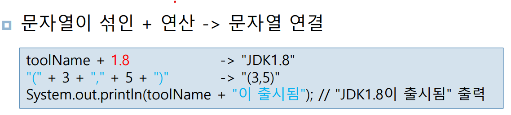
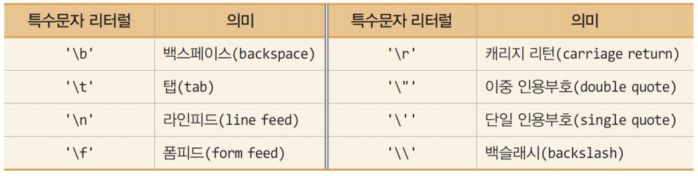
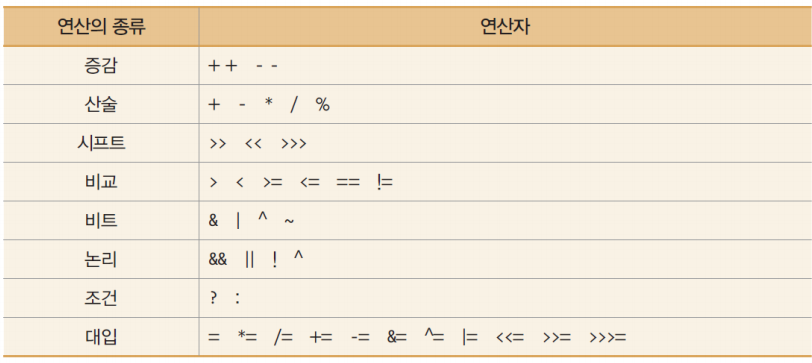
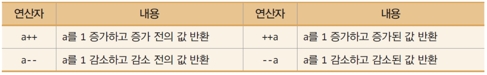
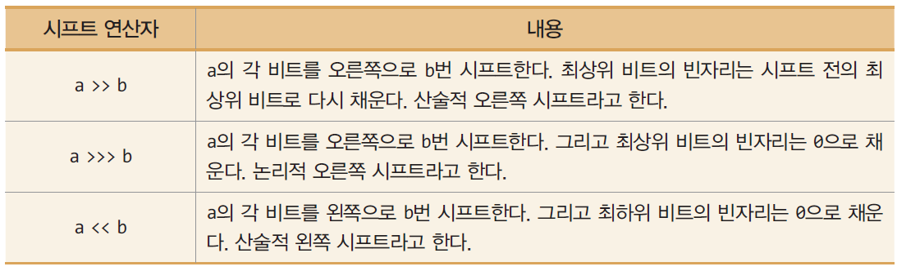

# 2주차

소유자: Andy Lee
최종 편집 일시: 2024년 3월 24일 오후 4:04

# 자바의 프로그램의 기본 구조 이해

## 주석문

블럭 주석: /**/
라인 주석: //

## 클래스

Java 언어는 반드시 클래스 생성부터 시작
**Java의 모든 코드는 반드시 클래스 안에서만 정의
메소드(함수) 선언도 클래스 안에서만**

## `main()` 메소드

Java의 main() 메소드는 `public static void main(String[] args) {}` 형태를 가진다.
public은 누구나 접근할 수 있는

<aside>
❗ static은 “유일한”
**static method는 static 멤버(변수, 메소드) 만 접근할 수 있다.**

</aside>

String은 문자열 []은 배열
main() 메소드가 종료되면 프로그램이 종료
(C언어와 같음)
단, main() 메소드는 속해있는 클래스와 다른 것이다.

## 변수 선언

```java
int i = 20;
char a = 'A'
```

Java의 문자형 변수는 ‘A’ 로 표현
문자열은 “Hello World” 로 표현

## 화면 출력

```java
char a = ‘?’;
System.out.println(a);
```

여기서 println() 메소드는 뒤에 `.toString` 을 자동으로 붙여주어 문자열로 변환하여 출력해줌.

메소드 안에서 만들어진 변수는 ~~그냥~~ 변수

## ⭐ 멤버 변수

클래스 안에서 만들어진 변수는 멤버 변수
멤버 변수 앞에는 접근 권한을 줘야함

<aside>
❗ **접근 권한의 종류에는 public / 생략 (default) / protected / private  가 있음**

</aside>

protected 권한: 범위 내에서만 public하게 접근 허용

## 출력 메소드 종류

```java
System.out.println() // 안의 변수를 문자열로 변환하여 출력하고 줄바꿈까지 실행

System.out.print() // 안의 변수를 문자열로 변환하여 출력하고 줄바꿈하지 않음

System.out.printf() // C의 printf()와 비슷함
```

## ⭐ 식별자 규칙

‘_’ 와 ‘$’ 를 제외한 특수문자 사용 불가능
유니코드 문자 사용 가능, 한글 변수명 사용 가능 (되도록 사용 X)
키워드(예약어) 사용 불가 (true, false, null 포함)
대소문자 구분
첫 문자로 숫자 사용 불가

## ⭐ 자료형

### 기본타입 8가지

CPU나 운영체제에 따라 바뀌지 않는다.

**논리형**
`boolean` (1 bit, true/false)

**문자형**
`char` (2 byte, 유니코드)

**정수형**
`byte` (1 byte)
`short` (2 byte)
`int` (4 byte)
`long` (8 byte)

**실수형**
`float` (4 byte)
`double` (8 byte)

### 레퍼런스 타입: 1개이며 용도는 3가지

`클래스(class)`에 대한 레퍼런스
`인터페이스(interface)`에 대한 레퍼런스
`배열(array)`에 대한 레퍼런스

문자열은 기본 타입이 아님
String 클래스로 문자열 표현
`String toolName = “JDK”;`



## 리터럴

프로그램에서 직접 표현한 값
정수, 실수, 문자, 논리, 문자열 리터럴이 있음

### 정수 리터럴

15 → 10진수 (10진수로)15
**0**15 → 8진수 (10진수로)13
**0x**15 → 16진수 (10진수로)21
**0b**0101 → 2진수 (10진수로)5

정수 리터럴은 `int` 타입으로 컴파일
정수 리터럴을 `long` 타입으로 저장하고자 하면 숫자 뒤에 `L 또는 l` 을 붙여야 한다.
ex) `long g = 24L`

### 실수 리터럴

소수점 형태나 지수 형태로 실수를 표현한 값
`12.` `12.0` `.1234` `0.1234` `1234E-4`

실수 리터럴은 `double` 타입으로 컴파일
ex) `double e = 1234E-4;` // 1234E-4 = $1234*10^{-4}$ 이므로 0.1234와 동일

숫자 뒤에 `f 또는 F` 를 붙이면 `float` 타입으로
`d 또는 D` 를 붙이면 `double` 타입으로 강제 변환할 수 있다.

### 문자 리터럴 / 특수문자 리터럴

문자 리터럴은 단일 인용부호`(' ')` 로 문자 표현
\u 다음에 문자의 유니코드 값을 사용하여 표현 가능

특수문자 리터럴은 `\` 로 시작



### 논리타입 리터럴

`true` 또는 `false` 뿐

boolean 타입은 C언어와 달리 0, 1로 true, false 표현하지 않는다.
따라서 무한루프는 `while(true)` 사용

### 이외의 리터럴

**null**
레퍼런스에 대입 사용
`~~int n = null;`~~
`String str = null;`

**문자열 리터럴**
이중 인용부호 `(" ")` 로 표현
문자열 리터럴은 `String 객체`로 자동 처리

### ⭐ 상수 리터럴

`final` 키워드 사용
선언 시 초깃값 지정
**실행 중 값 변경 불가**

`final double PI = 3.141592;`
static final로 상수를 선언하면 인스턴스가 만들어질 때마다 새로운 메모리에 초기화하지 않고, 하나의 메모리 공간만을 사용할 수 있다. 이렇게 되면 ***인스턴스 생성마다 매번 같은 메모리를 잡지 않아 효율적이다.***

### ~~var (Java8는 사용 X) (참고만)~~

~~Java10 부터 도입
타입을 생략하고 변수 선언 가능
변수 선언 시 초깃값 주어져야 함
지역 변수 선언에만 한정~~

## 타입 변환

변수나 상수 혹은 리터럴을 다른 타입으로 변환하는 것

### **자동 타입 변환**

컴파일러에 의해 원래의 타입보다 큰 타입으로 자동 변환

### ⭐ 강제 타입 변환

**`double b = (double) a;`** 로 명시적 타입 변환도 가능
**(내림 변환은 반드시 명시적 타입 변환 해줘야 함)**
(강제 변환은 값 손실 우려가 있음)

## Scanner 클래스

키보드에 입력된 키를 문자나 정수, 실수, 문자열 등 사용자가 원하는 타입으로 변환하여 리턴

```java
import java.util.Scanner; // java.util 은 패키지라 부른다.
...
Scanner a = new Scanner(System.in); // Scanner 객체 생성

/*
객체를 만드는 방법
클래스이름 객체이름 = new 생성자();
*/

String name = a.next(); // 문장
int age = a.nextInt(); // 정수
```

클래스를 통해 객체를 만들어 이용 (클래스는 메모리를 차지하지 못함)
생성자는 일종의 메소드, 이름은 클래스이름과 같음

Scanner는 입력되는 키 값을 공백으로 구분하는 토큰 단위로 구분되는 토큰 단위로 읽음
공백 문자: \t, \n 등

### ⭐ Scanner 주요 메소드

**`String next()`** ▶ 다음 토큰을 문자열로 리턴

**(정수형)**
**`byte nextByte()`
`short nextShort()`
`int nextInt()`
`long nextLong()`**

**(실수형)**
**`float nextFloat()`
`double nextDouble()`**

**(boolean)**
**`boolean nextBoolean()`** 

**`String nextLine()`** ▶ ‘\n’을 포함하는 한 라인을 읽고 ‘\n’을 버린 나머지만 문자열로 리턴

**`void close()`** ▶ 객체를 사용 종료

**`boolean hasNext()`**
▶ 현재 입력된 토큰이 있으면 true, 아니면 새로운 입력 때까지 무한정 대기.
새로운 입력이 들어올 때 true 리턴, ctrl-z 키가 입력되면 입력 끝이므로 false 리턴

## 연산자



### 증감 연산자



### 조건 연산자

`opr1?opr2:opr3`
opr1 이 `true`면, 연산식의 결과는 opr2, `false`면 opr3

### 시프트 연산자



## 조건문

### 단순 if 문

```java
if(조건식) {
		... 실행문장 ...
}
```

실행문장이 단일 문장인 경우 둘러싸는 { } 생략 가능

### if-else 문

```java
if(조건식) {
		... 실행문장1 ...
}
else {
		... 실행문장2 ...
}
```

### 다중 if-else 문

```java
if(조건식1) {
		... 실행문장1 ...
}
else if(조건식2) {
		... 실행문장2 ...
}
else if(조건식3) {
		... 실행문장3 ...
}
else {
		... 실행문장; ...
}
```

## switch 문

```java
switch(식) {
	case 값1:
		실행문장1;
		break;
	
	case 값2:
		실행문장2;
		break;
	...
	case 값n:
		실행문장n;
		break;
	
	default:  // 어느 것과도 같지 않을 때 (생략가능)
		실행문장;
	}
```

**`case` 문**
C와 달리 문자열도 조건으로 사용 가능하다.
단, 변수나 식을 사용할 수 없다.