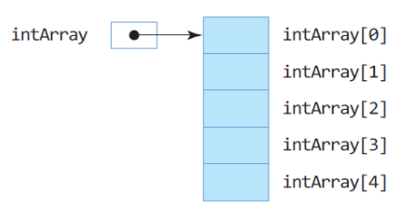

# 3주차

소유자: Andy Lee
최종 편집 일시: 2024년 4월 24일 오후 2:42

# 반복 제어문

## for 문

```java
// 기본구조:
for(초기문; 조건식; 반복 후 작업) {
	.. 작업문 ..
}

for(int i=0; i<10; i++) {
	System.out.print(i);
}
// (결과값) 0123456789

// 변수가 미리 선언되어있다면:
for(i=0; i<10; i++, System.out.println(i)) {
	..........
}

// 무한반복문:
for(초기문; true; 반복 후 작업) {
	..........
}

// 무한반복문 (권장하지 않음):
for(초기문; ; 반복 후 작업) {
	..........
}

// for문 다른 형태
for(임시변수 : 컬렉션) {
	..........
}
```

**컬렉션**이란 여러 개의 값 또는 요소를 담고 있는 객체
단 하나의 값이 아닌 같은 형태의 여러 개의 값을 갖고 있음
배열, 객체들의 배열 같은 값 → (1개씩 차례대로) 컬렉션의 모든 요소가 다 처리될 때까지 반복 실행

## while 문

```java
// 기본구조:
while(조건식) {
	.. 작업문 ..
}
```

## do-while 문

```java
// 기본구조:
do {
	.. 작업문 ..
} while(조건식);
```

조건식이 ‘참’인 동안 반복 실행
작업문은 한 번 반드시 실행

## 중첩 반복

반복문이 다른 반복문을 내포하는 구조

```java
// 10000명의 학생이 있는 100개 대학의 모든 학생 성적의 합을 구할 때 for 문을 이용한 이중 중첩 구조
for(i=0; i<100; i++) {
	for(j=0; j<10000; j++) {
		....
		....
	}
	....
}
```

## continue 문

반복문을 빠져 나가지 않고, 다음 반복으로 제어 변경

반복문에서 continue; 문에 의한 분기


## break 문

반복문 하나를 즉시 벗어나갈 때 사용

- 하나의 반복문만 벗어남
- 중첩 반복의 경우 안쪽 반복문의 break 문이 실행되면 안쪽 반복문만 벗어남


# 배열 (array)

*(for 문에서 컬렉션과 관련)*

**Java의 배열은 객체이다.**

배열은 같은 타입의 데이터들이 순차적으로 저장되는 공간

- 원소 데이터들이 순차적으로 저장됨
- 인덱스를 이용하여 원소 데이터 접근 (**배열 인덱스는 0부터 시작**)
- 반복문을 이용하여 처리하기에 적합한 자료 구조

```java
// 정수형 요소들로 이루어진 'i'란 배열 생성
// 객체 생성을 위한 new 사용: 요소의 자료형[배열의 요소의 개수]
int i[] = new int[10];
```

length 라는 이름의 변수가 추가되어 있음 (위 예제문에는 10이 저장되어 있음)
앞의 [ ]에 크기를 집어 넣을 수 없음

```java
// 직접 배열을 선언하고 초기값을 줄 수도 있다.
int i[] = {4, 55, 32, 28, 34, ...}
```

## ⭐ 배열 선언과 생성 (추가 공부)

레퍼런스 변수는 C의 포인터와 유사

```java
int intArray []; // 배열타입 배열에대한레퍼런스변수 배열선언;
intArray = new int [5];

//또는
int intArray[] = new int [5];

//또는
int[] intArray = new int[5];
```



```java
// 다음과 같이 생성 안 됨
int intArray[5];
```

## 배열 인덱스

배열의 인데스는 정수만 가능하다.

인덱스는 `0`부터 시작하며 마지막 원소의 인덱스는 `배열크기-1` 이다.

```java
int intArray = new int[5]; // 이 인덱스는 0~4까지 가능합
intArray[0] = 5; // 원소 0에 5 저장
intArray[3] = 6; // 원소 3에 6 저장
int n = intArray[3]; // 원소 3의 값을 읽어 n에 저장
```

## ⭐ 레퍼런스 치환과 배열 공유

Java에서는 배열 공간과 레퍼런스 변수가 분리되어 있기 때문에 생성된 배열에 대한 공유가 쉽게 이루어진다. 즉 생성된 배열을 다수의 레퍼런스가 참조할 수 있다.


## 배열의 크기, length 필드

배열의 크기는 배열 객체의 length 필드에 저장


## ⭐⭐ 배열과 for-each 문

배열이나 나열(enumeration)의 원소를 순차 접근하는데 유용한 for 문

```java
//for-each 문으로 정수 배열의 합을 구하는 사례
int[] n = {1, 2, 3, 4, 5};
int sum = 0;

for (int k : n) {
	sum += k
}
```

p.109 Check TIme 예제 살펴봄

## 다차원 배열 - 2차원 배열

```java
// 2행 5열의 2차원 배열 생성
int intArray[][] = new int[2][5]
// 또는
int[][] intArray = new int[2][5]
```


### 2차원 배열의 length 필드

i.length → 2차원 배열의 행의 개수로, 2
i[n].length → n번째 행의 열의 개수
i[1].length → 첫번째 행의 열의 개수로, 5

### 배열 선언과 동시에 초기화

```java
int intArray[][] = {{0, 1, 2}, 
										{3, 4, 5},
										{6, 7, 8}}; // 3x3 배열 생성
										
char charArray[][] = {{'a', 'b', 'c'}, {'d', 'e', 'f'}}; // 2x3 배열 생성
```

# ⭐ 메소드의 배열 리턴 (추가 공부)

**배열의 레퍼런스만 리턴** (배열 전체가 리턴되는 것이 아님)

리턴하는 배열 타입과 리턴 받는 배열 타입 일치
리턴 타입에 배열의 크기를 지정하지 않음

```java
// 리턴타입[] 메소드이름()
int[] makeArray() {
	int temp[] = new int[4];
	return temp;
}
```


*가변형 배열 개인적으로 공부 추천*

# 자바의 예외 처리

## 예외란?

실행 중 오동작이나 결과에 악영향을 미치는 예상치 못한 상황 발생
▶ Java에서는 실행 중 발생하는 에러를 예외로 처리

예외가 발생하면 자바 플랫폼은 응용 프로그램이 예외를 처하도록 호출
▶ 응용 프로그램이 예외를 처리하지 않으면 프로그램 강제 종료 처리

예외 발생경우:

- 정수를 0으로 나누는 경우
- 배열의 크기보다 큰 인덱스로 배열의 원소를 접근하는 경우
- 정수를 읽는 코드가 실행되고 있을 때 사용자가 문자를 입력한 경우

## ⭐ 예외 처리, `try` - `catch` - `finally` 문

`catch`는 여러번 사용 가능, `finally`는 생략가능

```java
try {
		예외가 발생할 가능성이 있는 실행문(try 블록)
}

catch (처리할 예외 타입 선언) {
		예외 처리문 (catch 블록)
}

finally {
		예외 발생 여부와 상관 없이 무조건 실행되는 문장 (finally 블록)
}
```


### 자주 발생하는 예외


모든 예외를 나타내는 클래스는 `Exception`

# 실습문제를 풀면서 알게된 것들

## `charAt()` 메서드

Java의 `charAt()` 메서드는 **문자열(String)에서 특정 위치에 있는 문자를 반환**하는 메서드입니다. 이 메서드는 문자열 내의 각 문자에 인덱스(index)를 할당하고, 해당 인덱스에 해당하는 문자를 반환합니다. 문자열의 첫 번째 문자는 인덱스 0부터 시작합니다.

`charAt()` 메서드의 구문은 다음과 같습니다:

```java
char charAt(int index)
```

여기서 `index`는 반환하려는 문자의 위치를 나타내는 정수값입니다. 예를 들어, 문자열 "Hello"에서 `charAt(0)`은 `'H'`, `charAt(1)`은 `'e'`, `charAt(2)`는 `'l'`, `charAt(3)`은 `'l'`, `charAt(4)`는 `'o'`를 반환합니다.

다음은 `charAt()` 메서드를 사용하여 문자열에서 특정 위치에 있는 문자를 추출하는 예시입니다:

```java
String str = "Hello";
char ch1 = str.charAt(0); // 'H'
char ch2 = str.charAt(2); // 'l'
char ch3 = str.charAt(4); // 'o'
```

주의할 점은 `charAt()` 메서드를 사용할 때 인덱스가 문자열 길이보다 크거나 같은 경우 `StringIndexOutOfBoundsException`이 발생할 수 있습니다. 따라서 유효한 인덱스 범위 내에서 `charAt()` 메서드를 사용해야 합니다.

## 실습문제 5번 해결하지 못함.

## 문자열 비교하기

`String s, t;` 로 선언한 문자열 `s`와 `t`를 비교하기 위해서는 **`if(s.equals(t))`**로 비교해야 한다.