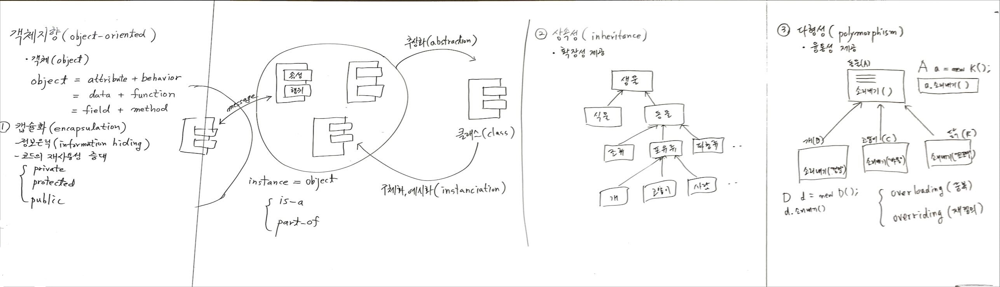
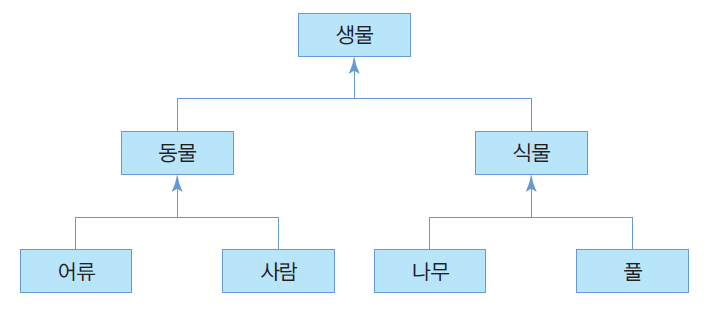
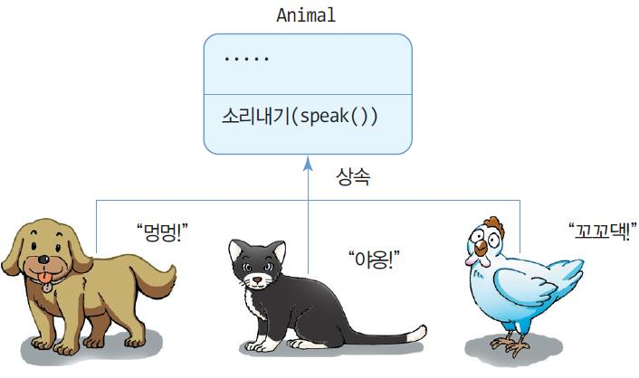

# 4주차

소유자: Andy Lee
최종 편집 일시: 2024년 4월 24일 오후 2:55

동영상 강의도 있음



# ⭐⭐⭐⭐⭐ 객체 지향 (object-oriented)
객체 지향의 개념에 대해 자세히 서술하시오..

## 객체

현실에서 볼 수 있는 사물 중 명사화할 수 있는 것.
물건 하나하나가 객체

**object
= attribute + behavior** (객체는 속성과 행위의 결합체)
= data + function
= field + method

(마카펜의 예시)
속성: 마카펜의 색상, 길이, 모양
행위: 필기, 도구

## 【객체 지향 특성】
1. 캡슐화 (encapsulation)

**속성과 행위를 하나로 묶는다.**

정보 은닉 (information hiding) ▶ 코드의 재사용성 증대

- private
- protected
- public

객체의 독립성 보장
객체끼리 유기적 소통을 위한 message 사용

클래스는 필드와 메소드로 이루어짐
클래스로는 일을 할 수 없고, 객체를 생성해서 사용 (클래스에는 메모리 부여 X)

### 추상화 (abstraction)

비슷한 객체들을 모아 카테고리화(추상화) 하여 그것을 대표하는 **`class`**

(붕어빵 틀)

### 구체화, 예시화 (instanciation)

클래스에 속성을 부여해서 객체(instance = object)를 생성

is-a : 객체와 클래스와의 관계
part-of : 객체와 객체와의 관계

객체는 실체, 클래스는 추상화된 개념

## 2. 상속성 (inheritance)

클래스들 간 계층적 관계성을 갖고 있음

**확장성** 제공

부모 클래스: `Super Class` / `Parent Class` / `Base(기저)`
자식 클래스: `Sub Class` / `Child Class` / `Derived(파생)`

부모 클래스: `Super Class` / `Parent Class` / `Base(기저)`
자식 클래스: `Sub Class` / `Child Class` / `derived(파생)` 

위에 있을 수록 일반화(generalization)
밑에 있을 수록 특수화(specialization)



```java
class Human extends Animal {
}
```

## 3. 다형성 (polymorphism)

**융통성** 제공

- **`overloading (중복)`**: 하나의 클래스 안에 같은 이름을 갖는 메소드를 여러 개 만들 수 있음
- **`overriding (재정의)`**: 부모 클래스로부터 받은 메소드를 동일한 이름만 유지한 채 다르게 작동

ex) 카멜레온은 상황(객체)에 따라 색깔(기능)이 바뀜



## 객체 지향 언어의 목적

### 소프트웨어의 생산성 향상

캡슐화, 상속, 다형성, 객체 등 소프트웨어 재사용을 위한 여러 장치 내장.
재사용과 부분 수정 빠름.
다시 만드는 부담 대폭 감소
소프트웨어 생산성 향상

### 실세계에 대한 쉬운 모델링

계산과 통계처리만 하던 과거의 프로그래밍과 달리 실세계에서 발생하는 일을 프로그래밍