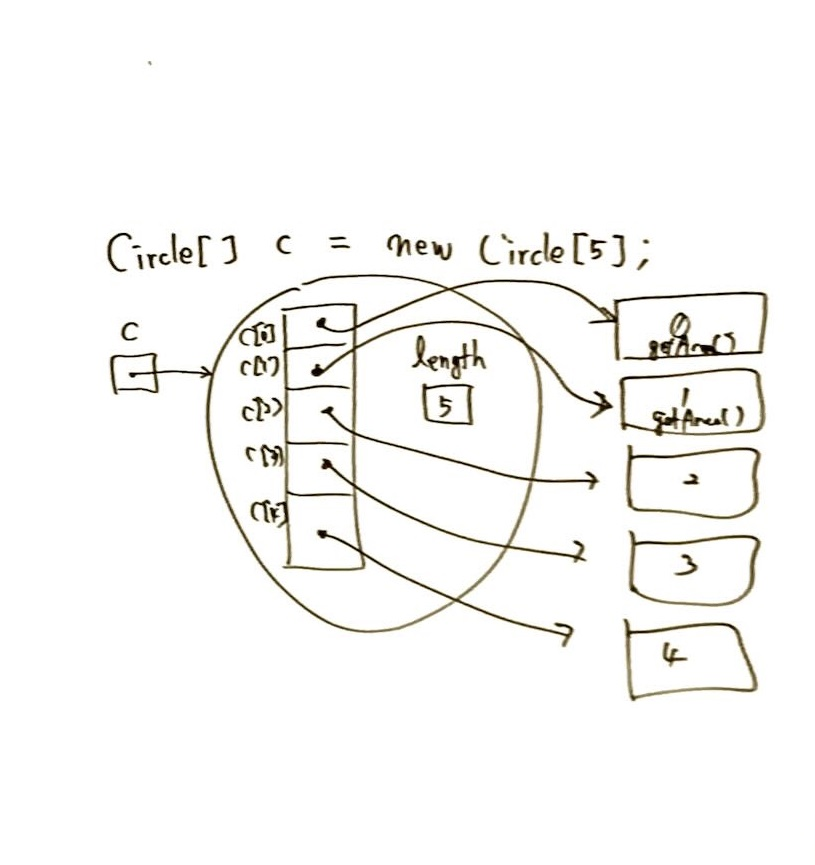
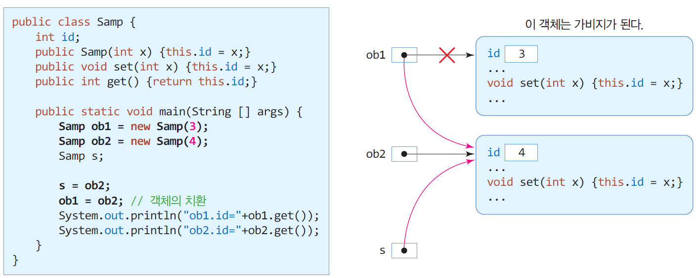
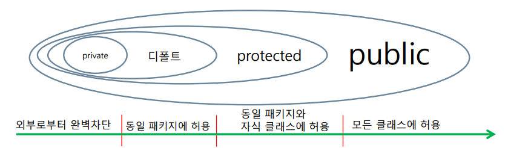
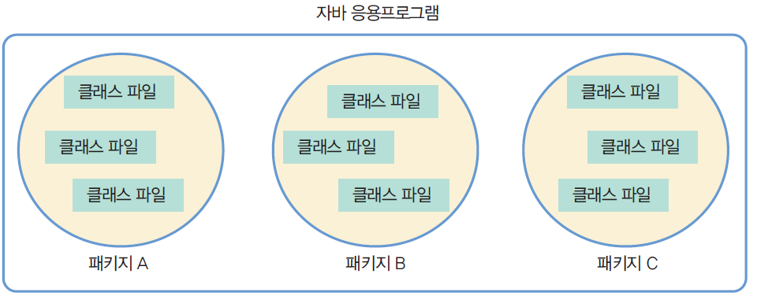
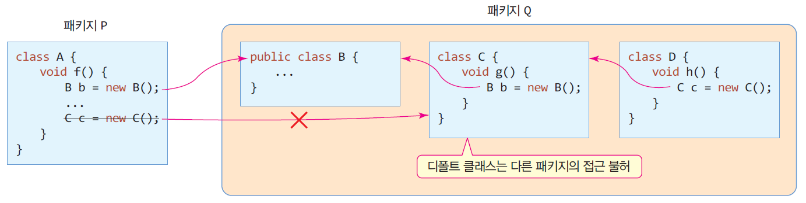
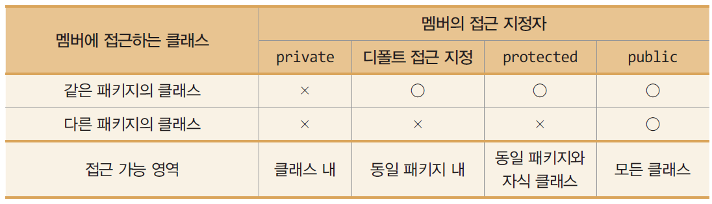
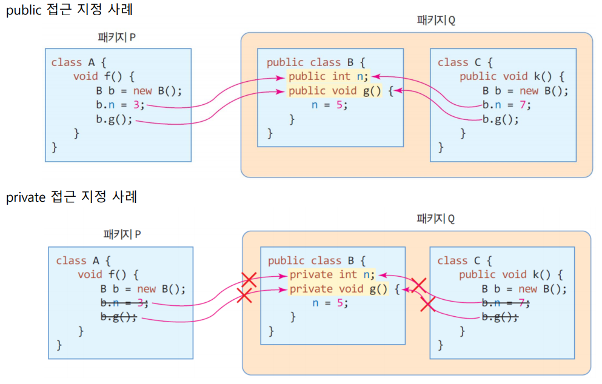
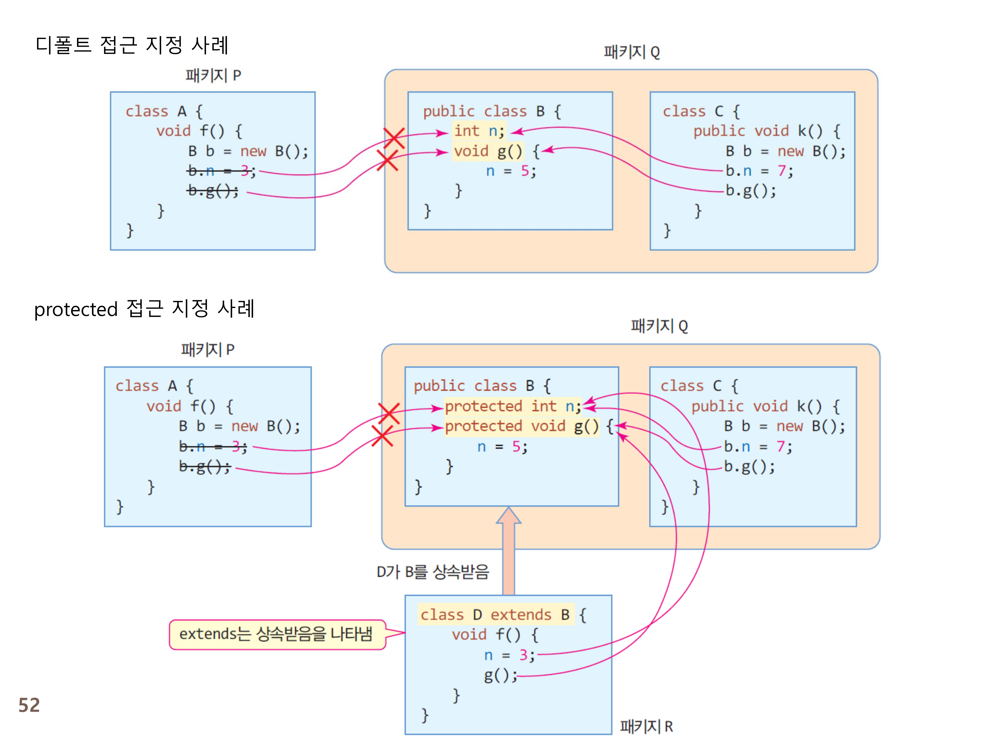

# 5주차

소유자: Andy Lee
최종 편집 일시: 2024년 4월 14일 오후 7:29

# 클래스

객체를 만들기 위한 틀

클래스는 선언적, 객체는 실체
▶ 객체에게만 메모리 부여

```java
public class Circle {
	(default) int radius;
	(default) String name;
	
	public double getArea() {
		return 3.14 * radius * radius
	}
}
```

클래스에 대한 public 접근 지정: 다른 모든 클래스에서 클래스 사용 허락
멤버에 대한 public 접근 지정: 다른 모든 클래스에게 멤버 접근 허용

❗ 모든 메소드는 클래스 안에 구현되어야 한다.
따라서 **`main` 메소드는 클래스 안에서 구현되지만, 멤버는 아니다.
또한, 속해있는 클래스와도 전혀 상관이 없다.**

Tip: ctrl + spacebar → intellisence 활성화 (오타 방지)

## 클래스 선언

❗ 소스파일명은 `public class`의 이름과 동일하다. *(소스코드내에 public class가 없다면 상관 X)*
❗ 하나의 소스파일 내에는 단 1개의 `public class`만 존재한다.

## ⭐⭐⭐ 생성자

객체가 만들어질때 자동으로 실행되는 메소드
생성자의 역할은 **객체의 멤버(필드)를 초기화하는 역할**

❗ 특이한 형태

1. 반환형이 없다. (Can’t use `return`)
2. 이름이 클래스 이름과 동일

### 기본 생성자 (default constructor)

따로 선언을 하지 않아도 컴파일러가 클래스 안에 자동으로 선언

```java
class 클래스이름 {
	**public 클래스이름() {}**  // 직접 정의해도 됨.
}
```

**클래스에 생성자가 선언되어 있는 경우**에는 **컴파일러가 기본 생성자를 자동 생성해주지 않는다.**

### method overloading (중복)

메소드의 중복이 되기 위해서는 **인수의 갯수가 다르거나 타입이 다르면 같은 이름의 메소드를 선언할 수 있다.**

### `this` 레퍼런스

객체 선언 순간 자기자신을 가리키는 `this` 라는 레퍼런스도 같이 생성
생성자를 만들 때 인수의 이름이 멤버의 이름과 같다면 앞에 `this` 를 붙여 구분해 줄 필요가 있다.

### ⭐⭐ `this` 메소드

```java
this(...);
```

**같은 클래스의 다른 생성자 호출
생성자 내에서만 사용 가능
생성자 코드의 제일 처음에 있어야 함.**

## 객체 배열



## 메소드

### call by value

Java의 기본 자료형 8가지는 call by value

### call by reference

객체 레퍼런스

배열 레퍼런스

### method overloading

같은 클래스내에 같은 이름의 서로다른 동작을 하는 메소드를 여러가지 만들 수 있음

다형성을 구현

리턴타입이 같아도 인수의 개수나 타입이 같다면 오류.

## Garbage Object

가리키는 레퍼런스가 하나도 없는 객체
JVM의 Garbage Collector가 수거해간다.



따라서, 기존 객체 레퍼런스에 `null` 값을 준다면, 객체가 소멸된다.

자바에는 객체 소멸 연산자가 따로 없다.

### Garbage Collection

```java
System.gc(); // Garbage Collection 임의 실행
```

### *객체 생성


Q. a가 사라져도 c가 가리키는 “Java” 는 그대로인가요?
A. Yes

# 접근 지정자

`private`, `public`, `protected`, `default`

정보은닉을 위해 사용



`protected`: 다른 패키지에 있더라도, 상속받은 자식 클래스라면 접근을 허용

## package

클래스들이 모여있는 directory



## 접근 지정자 사용처

### 클래스

**클래스의 접근 지정자는 객체 생성 여부를 결정.**

클래스 안의 클래스가 private 라더라도, 상위 클래스에서 접근 가능

(대부분 public / default 임)



### ⭐⭐⭐⭐⭐⭐⭐⭐⭐⭐⭐⭐⭐⭐ 멤버



`public` / `private`



`default` / `protected`

