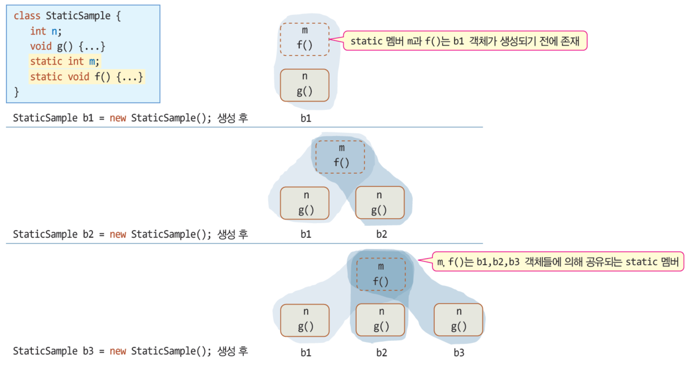
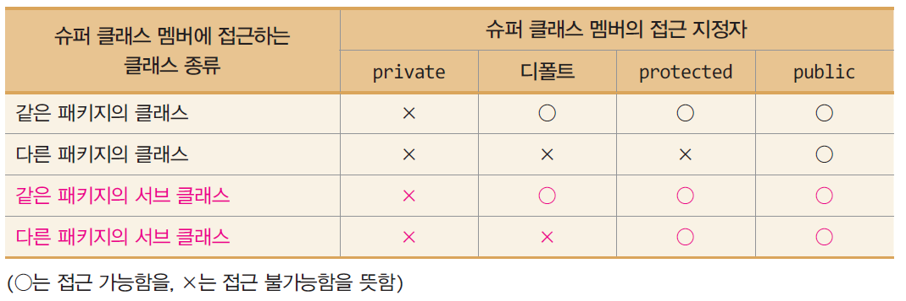
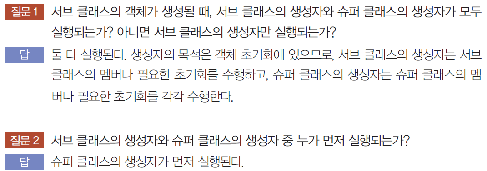

# 6주차

소유자: Andy Lee
최종 편집 일시: 2024년 4월 16일 오후 5:25

# 클래스

## static 멤버

static이 붙으면 static 멤버 / 붙지 않으면 non-static 멤버

static 멤버는 클래스당 하나만 존재 (static 멤버의 소유권은 클래스에 있다.)
아무리 많은 객체가 생성되더라도 static 멤버는 하나만 존재.
즉, **생성된 객체들이 모두 공유**한다.



static 멤버는 객체들에 의해 공유됨

클래스 로딩 시에 멤버 생성

- static 멤버는 객체가 만들어지기 전, 메모리에 미리 생성됨.
- 객체가 생기기 전에도 사용 가능
- 객체가 사라져도 멤버는 사라지지 않음 (프로그램이 종료될 때 사라짐)


non-static 멤버와 static 멤버의 차이
static 멤버 = 클래스 멤버

### 클래스 이름으로 접근 가능

```java
class StaticSample {
	static int m;
}

public class Main {
	StaticSample.m = 3;  //  클래스 이름으로 static 필드 접근
	
	StaticSample b1 = new StaticSample();
	b1.m = 3;  //  객체 이름으로 static 필드 접근
}
```

하지만, non-static 멤버는 클래스 이름으로 접근할 수 없다.

### static의 활용 (다시 정리 필요)

전역 변수와 전역 함수를 만들 때 활용

공유 멤버를 만들고자 할 때

매번 객체를 만들지 않고도 접근

### static 메소드의 제약 조건 1

<aside>
❗ static 메소드는 오직 static 멤버만 접근 가능

</aside>

객체가 생성되지 않은 상황에서도 static 메소드는 실행될 수 있기 때문에, non-static 멤버 활용 불가(non-static 메소드는 static 멤버 사용 가능)

### ⭐ static 메소드의 제약 조건 2

<aside>
❗ static 메소드는 this. 사용 불가

</aside>

## final

### final 클래스와 메소드

final 클래스: 더 이상 클래스 상속 불가능

fianl 메소드: 더 이상 오버라이딩 불가능

final 필드: 상수 생성

## getter / setter

클래스의 필드(멤버 변수)를 외부에서 접근하거나 변경할 수 있는 메서드를 제공.
이를 통해 데이터 캡슐화(Encapsulation)를 실현하고 객체의 상태를 안전하게 유지 가능.

**`private`**으로 선언된 필드는 외부에서 직접 접근할 수 없다. 대신 Getter와 Setter를 통해 필드에 접근하고 변경할 수 있다. 이를 통해 데이터의 무결성을 유지하고 보호할 수 있다.

# 상속

클래스의 확장성 제공

## 상속 선언

`extends` 키워드로 선언

부모 클래스 → 슈퍼 클래스(super class)
자식 클래스 → 서브 클래스(sub class)

**❗생성자 메소드는 상속 받지 않음**

## 자바 상속의 특징

### 클래스 다중 상속 불허

C++는 다중 상속 가능
자바는 인터페이스의 다중 상속 허용

### 모든 자바 클래스는 묵시적으로 Object 클래스 상속 받음

`java.lang.Object` 클래스는 모든 클래스의 슈퍼 클래스 (이후 배우게 됨)

## ⭐⭐⭐⭐⭐⭐⭐ 슈퍼 클래스 멤버에 대한 서브 클래스의 접근



## 생성자 실행과 호출



### ⭐⭐⭐⭐⭐⭐⭐⭐⭐⭐⭐⭐⭐⭐⭐⭐⭐⭐⭐⭐⭐⭐⭐⭐⭐ 호출

서브 클래스의 생성자가 먼저 호출.

**개발자의 명시적 지시가 없다면, 슈퍼 클래스의 생성자로 기본 생성자가 선택된다.**

**개발자의 명시적 선택: `super() method` 
서브 클래스 개발자가 슈퍼 클래스의 생성자 명시적 선택**

- `super(parameter)`
- **반드시 생성자 메소드의 첫 줄에 와야 한다.**

# 업캐스팅 (upcasting)

서브 클래스의 레퍼런스를 슈퍼 클래스의 레퍼런스에 대입

```java
class Person {}
class Student extends Person {}

Person person = new Student();
```

# 다운캐스팅 (downcasting)

슈퍼 클래스의 레퍼런스를 서브 클래스의 레퍼런스에 대입

**❗업캐스팅된 것을 다시 원래대로 되돌리는 것.**

묵시적 형변환이 일어나지 않기 때문에 **명시적 형변환을 해줘야 한다.**

```java
class Person {}
class Student extends Person {}

Person p = new Student();
Student s = (Student)p;
```

# 왜 필요할까?

다형성과 관련있다.

# instanceof 연산자

레퍼런스가 가리키는 객체의 타입 식별

```java
객체레퍼런스 instanceof 클래스타입  // 연산의 결과: true/false의 boolean 값
```