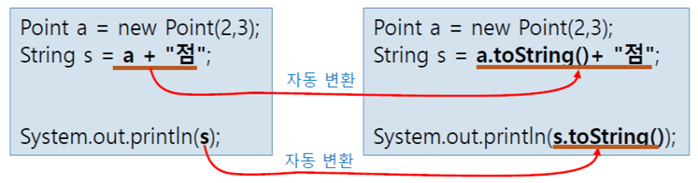
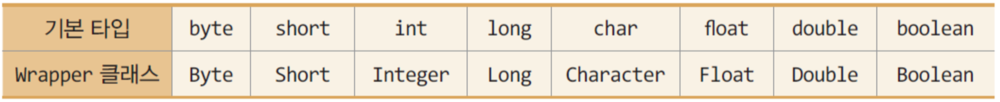
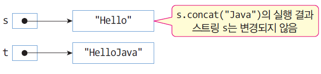
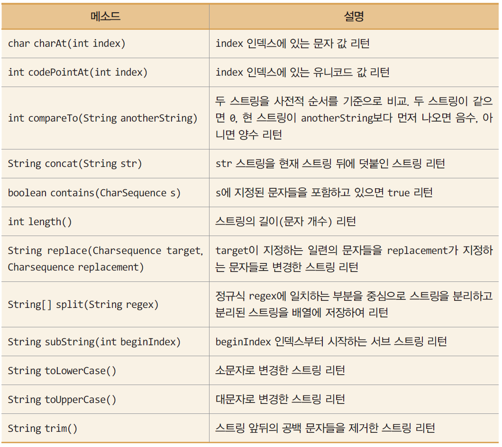
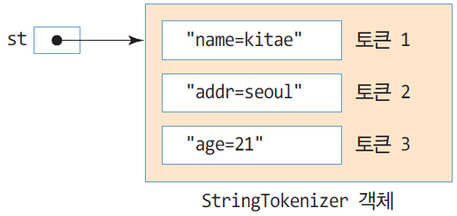

# 9주차

소유자: Andy Lee
최종 편집 일시: 2024년 5월 15일 오후 2:14

# 패키지

서로 관련된 클래스와 인터페이스를 컴파일한 클래스 파일들을 묶어 놓은 디렉터리

`import`를 사용하여 다른 패키지에 작성된 클래스 사용
`import ex.example.*`를 사용하여 패키지 전체를 import

## 패키지 선언

소스 파일의 맨 앞에 컴파일 후 저장될 패키지 지정

`package 패키지명;` 

### package 선언문이 없는 자바 소스 파일은

컴파일러는 클래스나 인터페이스를 디폴트 패키지에 소속시킴
*디폴트 패키지 = 현재 디렉터리*

## JDK의 주요 패키지

### `java.lang`

String, 수학 함수, 입출력 등 자바 프로그래밍에 필요한 기본적인 클래스와 인터페이스
자동으로 import 됨

### `java.util`

날짜, 시간, 벡터, 해시맵 등과 같은 다양한 유틸리티 클래스와 인터페이스

### `java.io`

키보드, 모니터, 프린터, 디스크 등에 입출력을 할 수 있는 클래스와 인터페이스

### `java.awt / javax.swing`

윈도우 프로그래밍에 사용

## Object 클래스

java.lang 패키지에 속한 클래스이며, 모든 클래스는 강제로 Object를 상속 받는다.

### ⭐ boolean equals(Object obj)

obj가 가리키는 객체와 현재 객체를 비교하여 같으면 true 리턴
보통 `Override` 해서 사용

❗equals() Override 예제 살펴봄

### Class getClass()

클래스에 대한 레퍼런스를 리턴
*현재는 사용할 필요 없음*

### int hashCode()

현 객체에 대한 고유 해시 코드 값 리턴
*현재는 사용할 필요 없음*

### ⭐ String toString()

현 객체에 대한 문자열 표현을 리턴
보통 `Override` 해서 사용
출력 결과는 클래스이름@해쉬코드

원형: `public String toString();` 



❗toString() Override 예제 살펴봄

## Wrapper 클래스

자바의 기본 타입을 클래스화한 8개 클래스를 통칭



### 많이 사용되는 Integer 클래스의 주요 메소드

`float floatValue()` / `int intValue()` / `long longValue()` / `short shortValue()` 
각 타입으로 값 리턴

`static int parseInt(String s)` / `static int parseInt(String s, int radix)` 
String s를 정수로 변환한 값 리턴 / String s를 지정된 진법의 정수로 변환한 값 리턴

`static String toString(int i)` / `…toBinaryString(int i)` / `…toHexString(int i)` / `toOctalString(int i)`
정수 i를 String, 이진수, 16진수, 8진수로 변환한 스트링 리턴

### 박싱과 언박싱

박싱: 기본 타입의 값을 Wrapper 객체로 변환

언박싱: Wrapper 객체에 들어 있는 기본 타입의 값을 빼내는 것

자동으로 박싱과 언박싱이 이루어짐.

# String

## String 객체는 수정이 불가능하다

일단 **생성된 스트링 객체는 수정이 불가능하다.**

```java
String s = new String("Hello"); // s의 스트링은 수정 불가능
String t = s.concat("Java"); // 스트링 s에 "Java"를 덧붙인 스트링 리턴

// 또는
s = s.concat("Java"); // s는 새로 리턴한 "HelloJava"를 가리킴
```



## String 비교

두 String을 비교할 때 반드시 `equals()`를 사용하여야 함

## String 활용



## StringBuffer 클래스

가변 스트링을 다루는 클래스

String 클래스와 달리 문자열 변경 가능

```java
StringBuffer sb = new StringBuffer("This");

sb.append(" is pencil.");  // sb = "This is pencil."
sb.insert(7, " my");  // sb = "This is my pencil."
sb.replace(8, 10, "your");  // sb = "This is your pencil."

System.out.println(sb);
```

## StringTokenizer 클래스

구분 문자를 기준으로 문자열을 분리하는 클래스

- 구분 문자 (delimiter): 문자열을 구분할 때 사용되는 문자
- 토큰 (token): 구분 문자로 분리된 문자열

### 예제

```java
String query = "name=kitae&addr=seoul&age=21";
StringTokenizer st = new StringTokenizer(qurey, "&");
/*
만약 StringTokenizer st = new StringTokenizer(qurey, "&="); 라면
구분 문자는 '&' 와 '=' 2개
*/
```



```java
int count = st.countTokens();  // 토큰 개수 알아내기. count = 3
String token = st.nextToken();  // 다음 토큰 얻어내기. st = "name=kitae"
```

# Math 클래스

기본 산술 연산 메소드를 제공하는 클래스
모든 메소드가 static으로 선언되어 있기 때문에 `Math.메소드` 형태로 사용 가능.

## `Math.random()` method

`random()` 은 0보다 크거나 같고 1.0보다 작은 실수 난수 발생

```java
for (int x = 0; x < 10; x++) {
	int n = (int)(Math.random() * 100 + 1);  // 1~100 까지의 랜덤 정수 발생
	System.out.println(n);
}
```

### *`java.util.Random` 클래스

```java
Random r = new Random();
int n = r.nextInt();  // 음수, 양수, 0을 포함하여 Java의 정수 범위 난수 발생
int m = r.nextInt(100);  // 0~99 사이(0과 99 포함)의 정수 난수 발생
```

## ⭐⭐⭐ Regular Expression (정규표현식) (개인적으로 공부하기)

# 모듈화

*모듈화의 목적만 설명하고 구체적으로 배우지는 않음*

패키지들의 집합체

세밀한 모듈화를 통해 필요없는 모듈이 로드되지 않게 함

# 컬렉션

요소라고 불리는 가변 개수의 객체들의 저장소

- 객체들의 컨테이너라고도 불림
- 요소의 개수에 따라 **크기 자동 조절**
- 요소의 삽입, 삭제에 따른 요소의 **위치 자동 이동**

고정 크기의 배열을 다루는 어려움 해소

다양한 객체들의 삽입, 삭제, 검색 등의 관리 용이

## 컬렉션의 특징

### 1. 컬렉션은 제네릭 기법으로 구현

<aside>
❗ 제네릭
특정 타입만 다루지 않고, 여러 종류의 타입으로 변신할 수 있도록 클래스나 메소드를 일반화 시키는 기법

</aside>

클래스나 인터페이스 이름에 <E>, <K>, <V> 등 **타입매개변수** 포함
타입매개변수: 컬렉션의 요소를 일반화시킨 타입

쉽게 말하자면, `Vector<E>` 를 `Vector<String>` 과 같이 정의한다면
반드시 String 자료형만 추가되어야 한다.

E: Element
T: Type
V: Value
K: Key

### 2. 컬렉션 요소는 객체만 가능

int, char, double 등의 기본 타입으로 구체화 불가능하다.

```java
Vector<int> v = new Vector<>();  // 컴파일 오류. int는 사용 불가.
Vector<Integer> v = new Vector<>();  // 정상 코드
```